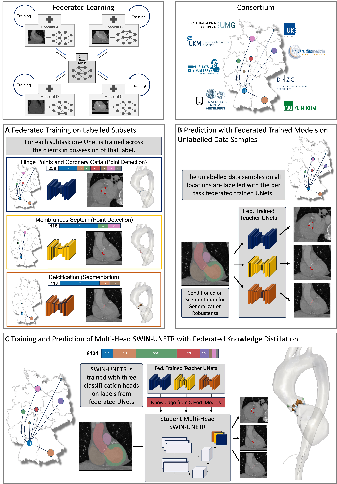
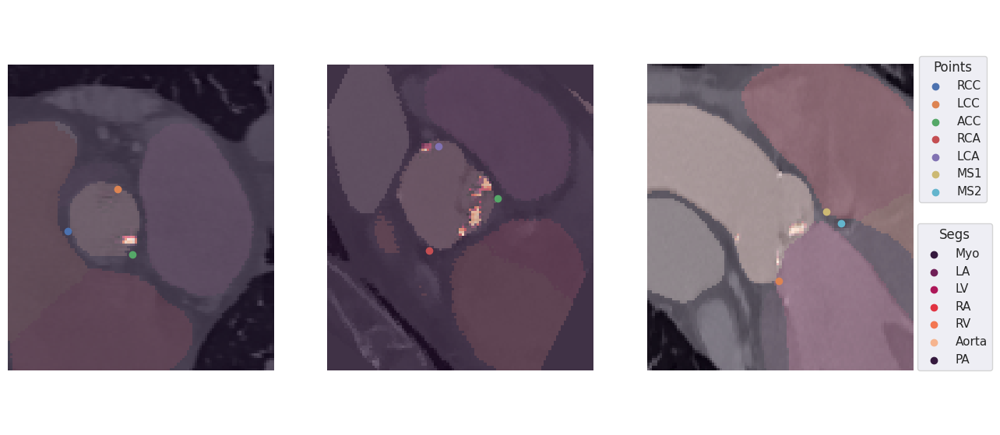
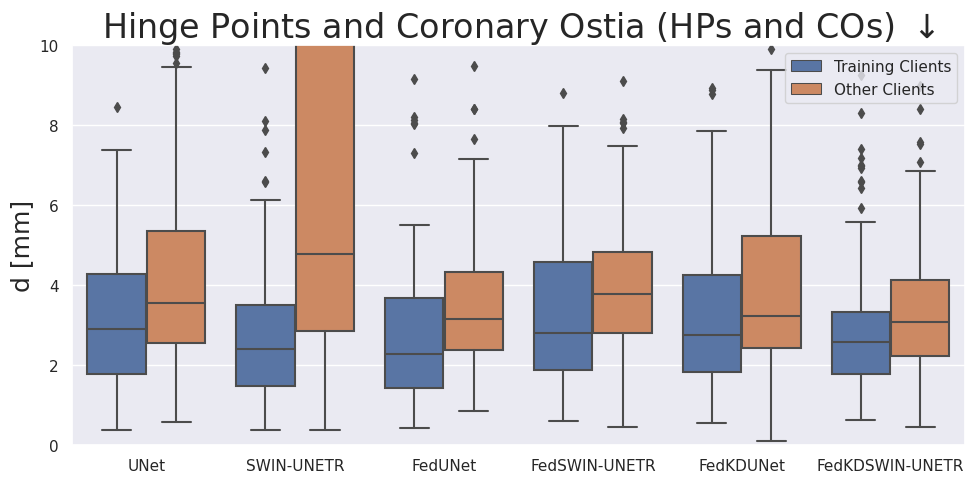
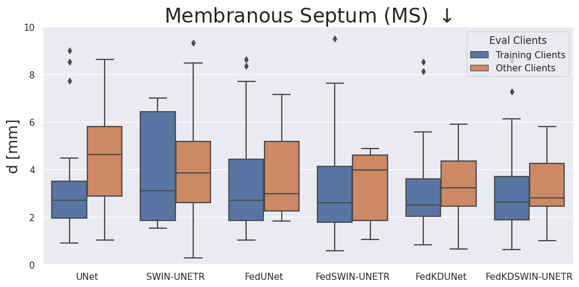
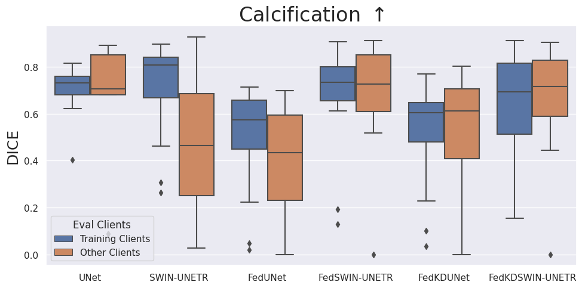
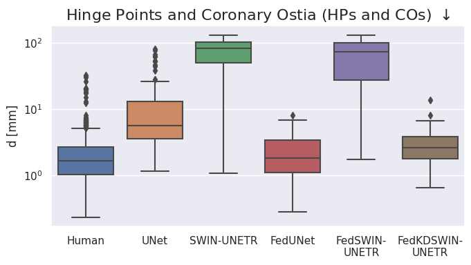

# Real World Federated Learning with a Knowledge Distilled Transformer for Cardiac CT Imaging

Malte Tölle, Philipp Garthe, Clemens Scherer, Jan Moritz Seliger, Andreas Leha, Nina Krüger, Stefan Simm, Simon Martin, Sebastian Eble, Halvar Kelm, Moritz Bednorz, Florian André, Peter Bannas, Gerhard Diller, Norbert Frey, Stefan Groß, Anja Hennemuth, Lars Kaderali, Alexander Meyer, Eike Nagel, Stefan Orwat, Moritz Seiffert, Tim Friede, Tim Seidler, Sandy Engelhardt

[Paper link](https://arxiv.org/abs/2407.07557)

## Abstract

Federated learning is a renowned technique for utilizing decentralized data while preserving privacy. 
However, real-world applications often face challenges like partially labeled datasets, where only a few locations have certain expert annotations, leaving large portions of unlabeled data unused. 
Leveraging these could enhance transformer architectures’ ability in regimes with small and diversely annotated sets.
We conduct the largest federated cardiac CT analysis to date ($n=8,104$) in a real-world setting across eight hospitals. Our two-step semi-supervised strategy distills knowledge from task-specific CNNs into a transformer. 
First, CNNs predict on unlabeled data per label type and then the transformer learns from these predictions with label-specific heads. 
This improves predictive accuracy and enables simultaneous learning of all partial labels across the federation, and outperforms UNet-based models in  generalizability on downstream tasks. 
Code and model weights are made openly available for leveraging future cardiac CT analysis.



## BibTeX

```
@article{toelle2024fedkd,
    title={Real World Federated Learning with a Knowledge Distilled Transformer for Cardiac CT Imaging},
    author={Tölle, Malte and Garthe, Philipp and Scherer, Clemens and Seliger, Jan Moritz and Leha, Andreas and Krüger, Nina and Simm, Stefan and Martin, Simon and Eble, Sebastian and Kelm, Halvar and Bednorz, Moritz and André, Florian and Bannas, Peter and Diller, Gerhard and Frey, Norbert and Groß, Stefan and Hennemuth, Anja and Kaderali, Lars and Meyer, Alexander and Nagel, Eike and Orwat, Stefan and Seiffert, Moritz and Friede, Tim and Seidler, Tim and Engelhardt, Sandy},
    year={2024},
    journal={npj Digital Medicine}
    doi={10.48550/arXiv.2407.07557}
}
```

## Run Instructions

### Train Federated

With the `train_federated.py`-script multiple trainings are possible. This is determined with the `--task`-flag: 0=KD, 1=HPS, 2=MS, 3=Calcification. Training and testing can be performed on any location combination wanted with the `--locations`-flag. `num_rounds` on each client, federated `epochs`, `batch_size`, and per-client `test_ratio` can be set. The network can either be conditioned on a segmentation (`--condition_on_seg`) or the segmentation can be trained simultaneously with another head (`--output_seg`). If a SWIN-UNETR shall be used as model, the `--patches`-flag can be set out of memory requirements. A pretrained ckeckpoint can be loaded with the `--ckpt`-flag.

```
python train_federated.py \
    --task [0,1,2,3] \
    --locations [loc1, loc2, ...] \
    --mode [train, test] \
    --num_rounds 1 \
    --epochs 10 \
    --batch_size 4 \
    --test_ratio 0.2 \
    --test_on_gobal_updates \
    --test_on_local_updates \
    --exp_name federated_point_detection \
    --ckpt ckpt.pt \
    --condition_on_seg \
    --patches \
    --model_type swin_unetr
```

### Download Pretrained Checkpoints

The checkpoints will be made available upon acceptance.

### Prediction on local data

```
python tavi_predictor.py --fname ct.nii.gz --tmp_dir ./tmp
```

This will create predictions of Hinge Points, Coronary Ostias, Membranous Septum, and Calcification.

## Results

In our federation of 10 university hospitals across Germany each holds different labels that are important in cardiac CT analysis prior to TAVI.
Despite the only partially existing labels across the participating locations we were able to learn one model that can predict all.
Still, the transformer-based model (SWIN-UNETR) performs worse than a UNet with the small amounts of labelled data per label.
By using the unlabelled data in a semi-supervised fashion with knowledge distillation we are able to increase the performance of the SWIN-UNETR.







We show that the performance of the model for predicting points is limited by the inter-observer variability between labeling locations.
Again, the SWIN-UNETR only performs on par with the federated trained UNet if the unlabeled samples are used in a semi-supervised fashion.



## Contact

Malte Tölle<br>
[malte.toelle@med.uni-heidelberg.de](mailto:malte.toelle@med.uni-heidelberg.de)<br>
[@maltetoelle](https://x.com/maltetoelle)<br>

Group Artificial Intelligence in Cardiovascular Medicine (AICM)<br>
Heidelberg University Hospital<br>
Im Neuenheimer Feld 410, 69120 Heidelberg, Germany